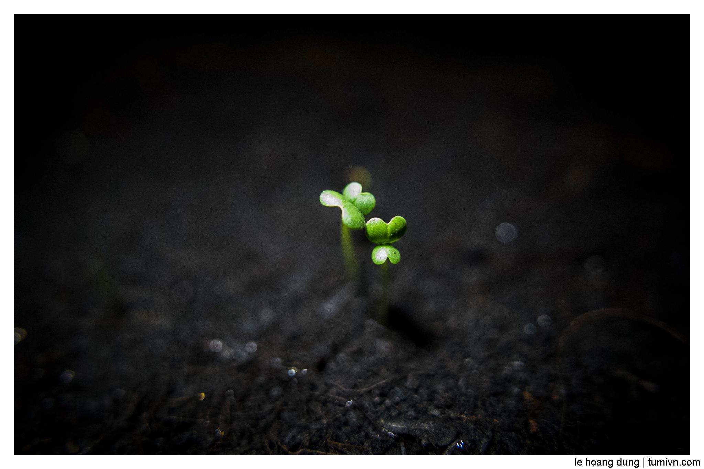

I am preparing the courses as well as book for learning. Plan is simple 

+ Reading book and note down important info in to my note. I will also mention in this diary but not in details.
+ Learning by doing, starting with some easy to learn video course to build the muscle memory and then develop the application by my own for my own requirements.
+ What to learn?
  + Spring / Spring Rest
  + Token based authentication / OAuth2 
  + Java stream 
  + Typescript / Angular and then React / Next.js (I like them both)
  + Spring Web Flux / Reactor
  + Data persitence with PostgreSQL and MongoDB
  + Hosting app on AWS
  + Microservices with Spring Cloud, Docker, Rabbit MQ / Kafka and K8S
  + Event driven architecture, CQRS

It will take me more than 1000 days to finish all the learning, however, everything start with small steps. Let get started.

The first book to read is the `Spring In Action 6th edition" written by Craig Wall. 
The first course to learn is the `Building Your First App with Spring Boot 2 and Angular 5` on PluralSight.

I must say I'm not a new bie in programming, so I'm familiar with Spring Boot, threading programming, have idea of reactive programming, know a little bit of Spring MVC, know RESTful in depth and know how to write unit test properly. I'm also familiar with Docker and have some fundamental learning with K8S. Have minimum skill of Bash Script. 

Every post will be with a photo taken by me. 

Happy coding. 

