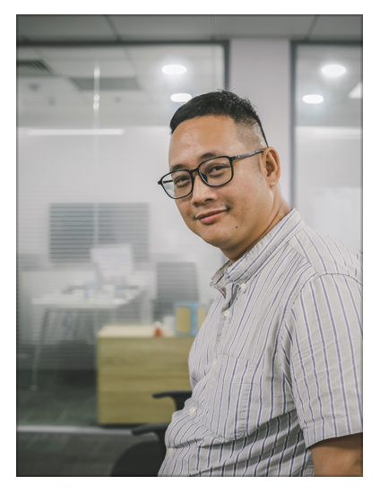

# Learning coding diary

I'm Dung Le, an ex-developer. I'm now working as a head of engineering for Software Tools for Automotive Industry. I missed my journey as a software developer, so I want to restart learning Java/Spring/React/Angular again so I can use it for some of my personal projects. 

You may know me as: 

  + An expert of workforce development, workforce planning, technical competence development.
  + [An leader that develop the business and has to take care hundred people of his team of delivering tools by using 200+ technical skills.](https://www.linkedin.com/in/ho%C3%A0ng-d%C5%A9ng-l%C3%AA-5a356221/)
  + [A blogger who writes artices related to how to live a better life and how to live with happiness in Vietnamese.](https://tumivn.com/)
  + [A youtuber/vlogger about soft skills for people who are working in IT industry and how to grow their careerpaths](https://www.youtube.com/channel/UChfAI8bOPOJIQOTE-qHRwew)
  + A teacher / mentor / coach
  + [A photographer](https://www.instagram.com/tumivn/)
  + A husband and a father of my beloved boy (MK)

But also don't forget that I'm a guy who love to code and want to build software by myself. These 999 days is a journey for me to breath the air like a software engineer and live a happy life of coding like what I had done in the past. I commit at least 1 hour per day for learning coding and writing software by using Java / Spring and other technologies in the rest of my life. 

Happy coding!
